#  멜팅, Melting

 

  

> '멜팅'은 AI와 함께 나만의 커버곡을 만들어 누구나 쉽게 앨범을 발매할 수 있는 웹앱 플랫폼 서비스입니다.

 

| [멜팅 랜딩 페이지](https://j11a701.p.ssafy.io) | [멜팅 서비스](https://j11a701.p.ssafy.io/main) | [다양성 팀 Notion](https://www.notion.so/jmxx219/d6dd5f133d194f14becf18077ff9bfb6) |
| :--------------------------------------------: | :--------------------------------------------: | :--------------------------------------------------------------------------------: |

  

## 목차

1. [개요](#개요)
2. [핵심 기능 소개](#기능-소개)
3. [서비스 소개](#서비스-소개)
4. [프로젝트 설계](#프로젝트-설계)
5. [개발 환경 및 기술 스택](#개발-환경-및-기술-스택)
6. [팀원 소개](#팀원-소개)

 

## [개요](#목차)

> **개발 기간** : `2024-09-26 ~ 2024-10-10`

 

멜팅은 AI를 활용해 누구나 손쉽게 커버곡을 만들고 앨범을 발매할 수 있는 플랫폼입니다. 최근 AI 기술과 음악이 결합된 사례들이 많은 주목을 받고 있으며, 특히 AI를 활용한 커버곡에 대한 관심이 높아지고 있습니다. 멜팅은 노래 실력이 부족하거나 노래하는 것이 부끄러운 사람들도 자신의 목소리를 활용해 고품질의 커버곡을 제작하고, 이를 앨범으로 완성할 수 있도록 도와줍니다. 덕분에 일반인도 가수처럼 자신만의 앨범을 멋지게 만들어볼 수 있습니다.

 
 
### **멜팅이란?**

멜팅은 녹는다 멜트(`melt`)와 녹음(`record`)의 이중적 의미를 언어유희적으로 살린 서비스명입니다.

 
 

## [핵심 기능 소개](#목차)

### 1. 노래 녹음(멜팅)

'멜팅'의 첫 번째 핵심 기능으로, 사용자가 자신의 목소리로 원하는 곡을 녹음하는 기능입니다. 다양한 MR(반주)을 제공하여, 선택한 MR에 맞춰 자신의 목소리를 녹음할 수 있습니다. 녹음된 곡은 '멜팅곡'으로 저장되며, 이후 AI 커버곡 생성이나 앨범 제작 과정에 활용됩니다. 이 기능은 AI 없이 순수하게 사용자의 목소리를 녹음하는 단계로, 사용자들은 자신의 원본 음성을 기반으로 창작 과정을 시작할 수 있습니다.

- 노이즈 제거 : 녹음된 목소리에서 잡음을 제거하기 위해 두 가지 모델을 사용합니다. (HP5_only_main_vocal / VR-DeEchoNormal)
- 싱크 보정 : 원곡과 녹음된 보이스의 시간차를 분석하여 타이밍을 보정합니다.
- 오디오 병합 : 원곡 MR과 사용자의 목소리를 병합하여 최종 결과물을 생성합니다.

 

### 2. AI 커버

'멜팅' 서비스의 두 번째 핵심 기능으로, AI가 사용자의 목소리를 학습하여 원곡 가수의 목소리를 사용자 목소리로 변환해 커버곡을 만드는 기능입니다. 사용자가 여러 곡을 녹음하여 AI가 이를 학습한 후, 원곡 가수의 음성을 바탕으로 변조된 보이스를 생성합니다. 이러한 커버곡 생성은 사용자가 실제 가수처럼 자신의 음성으로 완성된 노래를 경험할 수 있게 해줍니다.

- 사용자 모델 학습: 사용자가 부른 3곡을 바탕으로 AI가 학습을 시작하며, 1epoch 학습으로 자연스러운 커버곡을 생성합니다.
- AI 추론: 학습된 모델을 통해 원곡 가수의 보이스를 사용자 보이스로 변환하고, 원곡 보이스의 성별과 사용자 성별을 입력받아서 옥타브 변경 진행합니다.
- 사용 모델: RVC(Retrieval-based Voice Conversion) ver2 모델을 사용하여 고품질의 변환을 지원합니다.

 

### 3. 앨범 제작

사용자가 멜팅한 곡 또는 AI 커버곡을 선택하여 나만의 앨범을 제작할 수 있는 기능입니다. AI가 자동으로 앨범 커버 이미지와 앨범 소개 문구를 생성하여, 사용자는 별도의 이미지 편집이나 글쓰기 작업 없이도 손쉽게 나만의 앨범을 간편하게 발매할 수 있습니다. 이를 통해 누구나 손쉽게 앨범을 발매하고 공유할 수 있습니다.

- 앨범 커버 이미지 생성: AI 프롬프트를 통해 트랙 곡 가사 요약을 바탕으로 앨범 커버 이미지를 자동 생성합니다.
- 앨범 소개 문구 작성: 프롬프트를 통해 앨범의 장르/해시태그/가사를 이용하여 앨범 소개를 자동으로 작성합니다.

 

### 차별점/독창성

1. Logback & Mattermost 웹훅 Error 로깅: 중요한 오류를 실시간으로 Mattermost에 알림으로써 빠른 대응이 가능합니다.
2. ElasticSearch & Nori 플러그인: 한국어 해시태그 검색을 최적화하여 정확하고 빠른 검색 경험을 제공합니다.
3. GPT-4o, DALL-E 3: AI를 활용하여 가사를 요약하고 앨범 소개문과 앨범 커버 이미지를 자동으로 생성해, 사용자 편의성을 극대화합니다.
4. Spring Batch & Scheduler: 일별, 월별로 자동으로 랭킹을 관리하고 갱신하여 사용자 활동을 측정합니다.
5. Redisson 분산락 적용: 좋아요 및 스트리밍 처리 시 동시성 문제를 해결하여 시스템 안정성 보장합니다.
6. Java Virtual Thread 활성화: 경량 스레드를 사용하여 성능을 최적화하였습니다.
7. React 컴포넌트 모듈화: 유지보수성을 높여 개발 속도를 향상시키고, 코드 품질을 개선시켰습니다.
8. 웹과 앱을 통한 멀티 플랫폼 제공: 멜팅 서비스는 웹과 앱 모두에서 동일한 사용자 경험을 제공하여 접근성을 향상시켰습니다.

 
 

## [서비스 소개](#목차)

### 1️⃣ <b>메인 페이지</b>

|                     **Login Page**                      |                        **Main Page**                        |                       **Main Page**                        |
| :-----------------------------------------------------: | :---------------------------------------------------------: | :--------------------------------------------------------: |
|  |  |  |

 

### 2️⃣ <b>곡 생성 페이지</b>

> 사용자가 자신의 목소리를 녹음하여 곡을 만드는 페이지로, MR을 선택하고 바로 녹음할 수 있습니다.

|                      **Melting Page**                      |                      **AI Cover Page**                      |
| :--------------------------------------------------------: | :---------------------------------------------------------: |
| 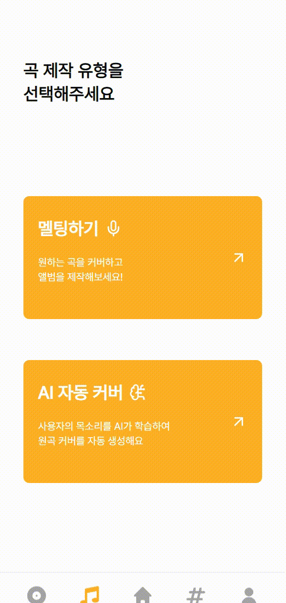 | 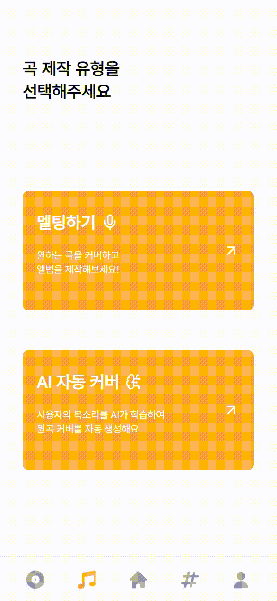 |

 

### 3️⃣ <b>앨범 제작 페이지</b>

> 완성된 커버곡과 멜팅곡을 선택하여 앨범을 발매하는 페이지입니다. 앨범 커버 이미지와 소개가 AI를 통해 자동 생성됩니다.

|                   **Album Register Page**                   |
| :---------------------------------------------------------: |
|  |

 

### 4️⃣ <b>켜뮤니티 페이지</b>

> 사용자들이 서로의 앨범을 공유하고 좋아요와 댓글을 남길 수 있는 커뮤니티 공간입니다.

|                     **Community Page**                      |                        **Search Page**                        |
| :---------------------------------------------------------: | :-----------------------------------------------------------: |
|  |  |

|                    **Album Detail Page**                     |                     **Album Streaming Page**                     |                     **Album Comment Page**                     |
| :----------------------------------------------------------: | :--------------------------------------------------------------: | :------------------------------------------------------------: |
| 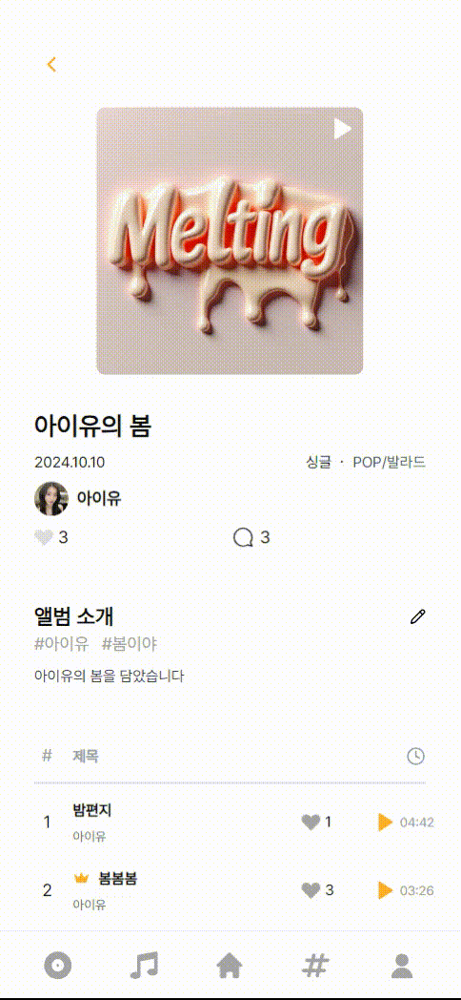 | 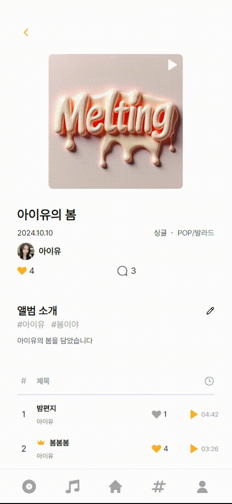 | 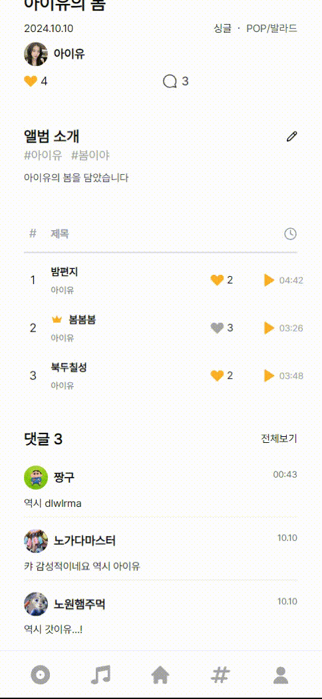 |

 

### 5️⃣ <b>마이 페이지</b>

|                          **Info Page**                          |                      **My Album/Song Page**                       |                      **Liked Album/Song Page**                       |
| :-------------------------------------------------------------: | :---------------------------------------------------------------: | :------------------------------------------------------------------: |
| 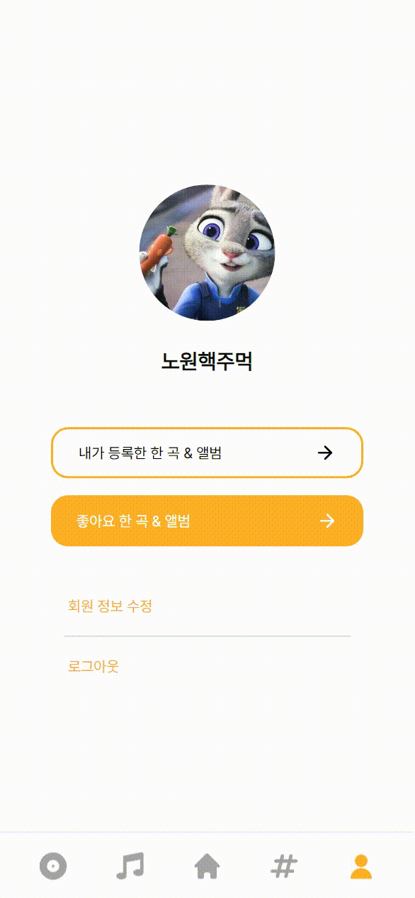 | 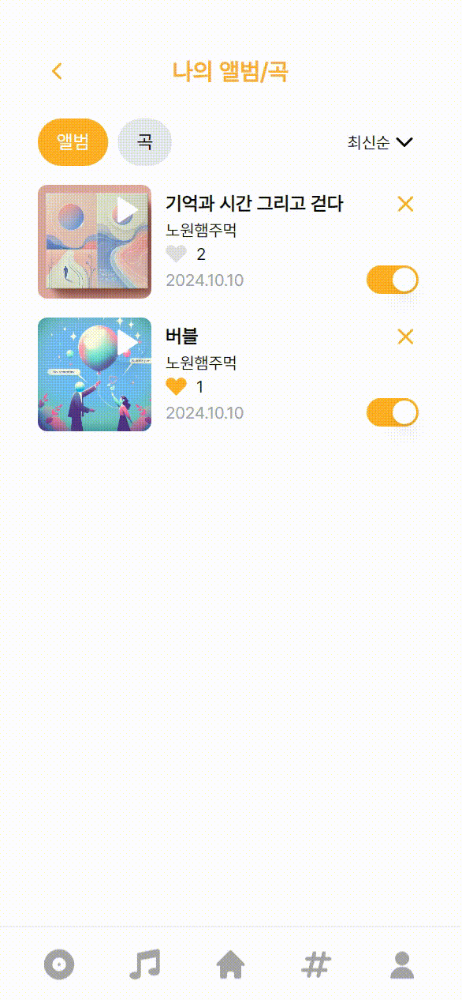 | 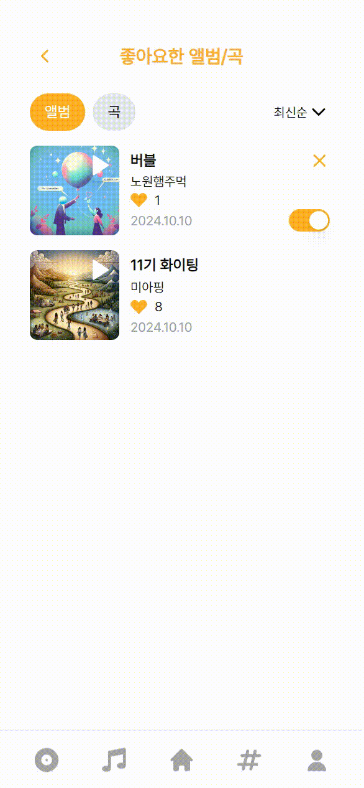 |

 
 

## [프로젝트 설계](#목차)

### 시스템 아키텍쳐

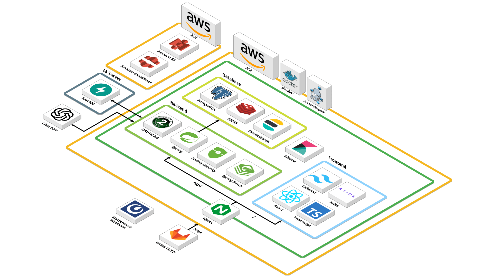

 

### ERD

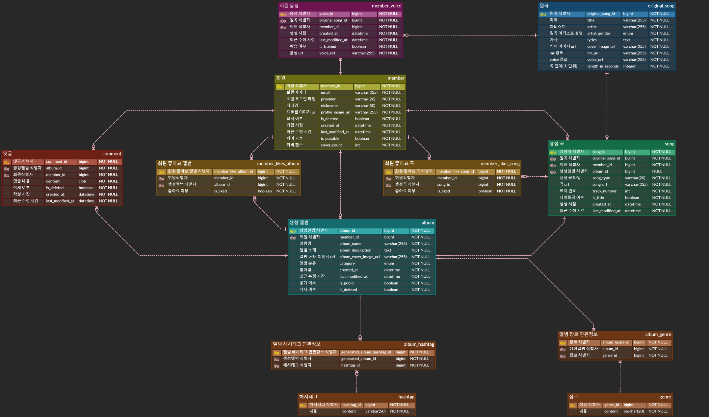

 

### API 명세서

Swagger API

 
 

## [개발 환경 및 기술 스택](#목차)

|      개발 환경      | 기술 스택                                                                                                                                                                                                                                                                                                                                                                                                                                                                                                                                                                                                                                                                                                                                                                                                                 |     |
| :-----------------: | :------------------------------------------------------------------------------------------------------------------------------------------------------------------------------------------------------------------------------------------------------------------------------------------------------------------------------------------------------------------------------------------------------------------------------------------------------------------------------------------------------------------------------------------------------------------------------------------------------------------------------------------------------------------------------------------------------------------------------------------------------------------------------------------------------------------------ | --- |
|    **Frontend**     |                                                                                       |
|     **Backend**     |        |
|       **DB**        |                                                                                                                                                                                                                                                                                                                                                                                                                                                                             |
|      **Infra**      |                                                                                                                                                                                                                                                                                                                                                                                                                                                                                                     |
| **Management Tool** |                                                                                                                                                                              |
|       **App**       |                                                                                                                                                                                                                                                                                                                                                                                                                                                                                                                                                                                                                                                                                                                                        |

 

다양성팀 JIRA

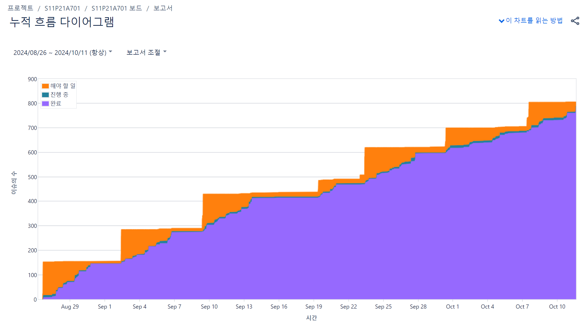

 
 

## [팀원 소개](#목차)

<table align="center">
  <tr>
    <th style="text-align: center;"><a href="https://github.com/tkdgus97">전상현</a></th>
    <th style="text-align: center;"><a href="https://github.com/btothey99">이보연</a></th>
    <th style="text-align: center;"><a href="https://github.com/jmxx219">손지민</a></th>
  </tr>
  <tr>
    <td style="text-align: center;"></td>
    <td style="text-align: center;"></td>
    <td style="text-align: center;"></td>
  </tr>
  <tr>
    <td style="text-align: center;"><b>Frontend</b></td>
    <td style="text-align: center;"><b>Frontend</b></td>
    <td style="text-align: center;"><b>Infra/Frontend</b></td>
  </tr>
</table>

<table align="center">
  <tr>
    <th style="text-align: center;"><a href="https://github.com/hyooun">유승현</a></th>
    <th style="text-align: center;"><a href="https://github.com/gyuoo">염규영</a></th>
    <th style="text-align: center;"><a href="https://github.com/EH05">최은혜</a></th>
  </tr>
  <tr>
    <td style="text-align: center;"></td>
    <td style="text-align: center;"></td>
    <td style="text-align: center;"></td>
  </tr>
  <tr>
    <td style="text-align: center;"><b>Backend</b></td>
    <td style="text-align: center;"><b>Backend</b></td>
    <td style="text-align: center;"><b>Backend/AI</b></td>
  </tr>
</table>

 
