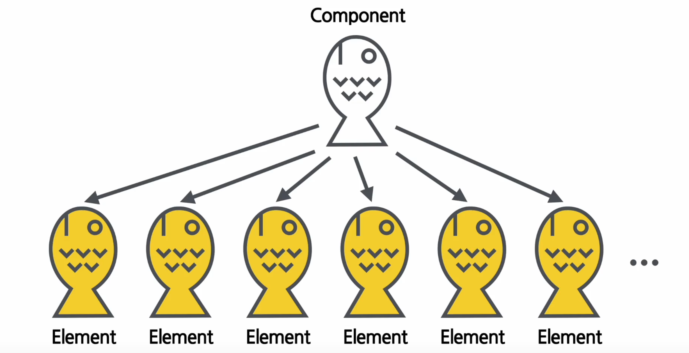

# 리액트

## 0. Virtual DOM

DOM?

웹 페이지에 대한 정보를 담고 있는 하나의 객체

빠른 업데이트를 위해 사용

화면이 업데이트 된다는 것은  DOM이 수정된다는 것을 의미한다. 이때 수정할 부분을 DOM 내에서 찾아야 하기 때문에 성능에 영향을 미친다. 

하지만 Virtual DOM 방식의 경우 업데이트할 최소한의 부분만 검색하여 변경한다. 

### 1. JSX(A syntax extension to JavaScript)

- 자바스크립트의 문법을 확장시킨것
- javascript + xml/html

```jsx
const element = <h1>hello</h1>;
```

- 내부적으로 xml, html을 Javascript 코드로 변환하며 React.createElement()가 해당 역할을 한다

```jsx
class Hello extends React.Componet {
		render(){
				return React.createElement('div', null, `Hello ${this.props.toWhat}`);
		}
}

ReactDom.render(
		React.createElement(Hello, {toWhat: 'World'}, null),
		...
)
```

- 장점
    - 간결한 코드
        - JSX를 사용하지 않고 createElement를 사용할 경우
    - 가독성 향상
    - Injection Attacks 방어
        - 입력창에 소스코드를 입력하여 실행하는 방식을 방어 가능
- Html 코드에서 변수 참조 시에 {} 안에 변수나 함수를 넣어 사용할 수 있다.
- 속성을 넣을 때는 “” 안에 값을 넣음

## 2. Element

- 리액트 앱의 가장 작은 빌딩 블록 즉 리액트 앱을 구성하는 가장 작은 블록들
- 불변성을 가짐
    - 정확히는 생성후에는 자식이나 속성을 바꿀 수 없다.
    - 컴포넌트를 통해 엘레먼트를 생성한다.
    - 결과적으로 새로운 Element를 만들어 바꾸는 방식으로 동작
    - 리액트의 Virtual DOM에서 Element를 re render 한다는 것을 의미한다
    - 리랜더링이란 즉 Virtual DOM에 존재하는 것을 실제 DOM으로 이동

## 3. 컴포넌트와 Props

- 컴포넌트는 틀 같은 존재라고 볼 수 있다.
- Props
    - property의 약어
    - 컴포넌트의 속성이라고 볼 수 있따
    - 같은 컴포넌트라도 색이나 이미지 등 다르게 구성하기 위해 필요한 속성
    - 즉 컴포넌트에 전달할 다양한 정보를 담고 있는 객체
    - readonly 라는 특성을 가진다 속성이 바뀐다는 것은 붕어빵을 다 구웠으니 속재료는 바꿔버리는 것




- 리액트 컴포넌트는 props에 대하여 pure 함수 같은 역할을 해야 한다.
    - 즉 props를 직접 바꿀 수 없고 같은 props에 대해서는 항상 같은 결과를 보여준다

- 컴포넌트는 함수 컴포넌트와 클래스 컴포넌트로 나뉜다.
    - 함수 컴포넌트
        - 앞서 액트 컴포넌트는 props에 대하여 pure 함수 같은 역할한다는 것을 보면 컴포넌트를 일종의 함수로 본다
    - 클래스 컴포넌트
        - React.Component를 상속받아 사용함
- 컴포넌트의 이름은 항상 대문자로 시작해야 한다! 소문자로 할 경우 dom 태그로 인식하기 때문이다.

- 아래처럼 여러개의 컴포넌트를 합친 것을 컴포넌트 합성이라고 한다
- 반대로 큰 컴포넌트에서 일부를 추출해서 새로운 컴포넌트를 만드는 것을 컴포넌트 추출이라고 한다

```jsx
interface Props2 {
    name : string
}
function Welcome(props : Props2) {
    return <h1>Welcome! {props.name}</h1>
}

function App(props : Props) {
    return (
        <div>
            <Welcome name={"name1"}></Welcome>
            <Welcome name={"name2"}></Welcome>
            <Welcome name={"name3"}></Welcome>
        </div>
    );
}
```

## 4. State

- state란 리액트 컴포넌트내에 변경 가능한 데이터를 state라고 한다.
- 랜더링이나 데이터 흐름에 사용되는 값만 state에 포함시켜야함
- state는 자바스크립트 객체이다!
- state는 직접 수정하면 안된다

## 5. Hook

왜 나왔는가?

클래스 컴포넌트에서는 생성자에서 state를 정의 setState 함수를 통해 state 업데이트가 가능하다

하지만 함수형 컴포넌트는 별도로 state를 정의하거나 컴포넌트의 생명주기에 맞춰 어떤 코드를 실행하기 힘듬 

이러한 한계를 해결하고자 Hook이 나오게됨 

- 이름 앞에는 use가 붙음

useEffect()

- mount, unmount 시에 단 한번씩만

```jsx
useEffect(함수, []);
```

- 생략시 컴포넌트 업데이트 시 실행